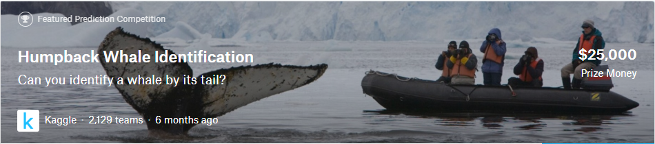
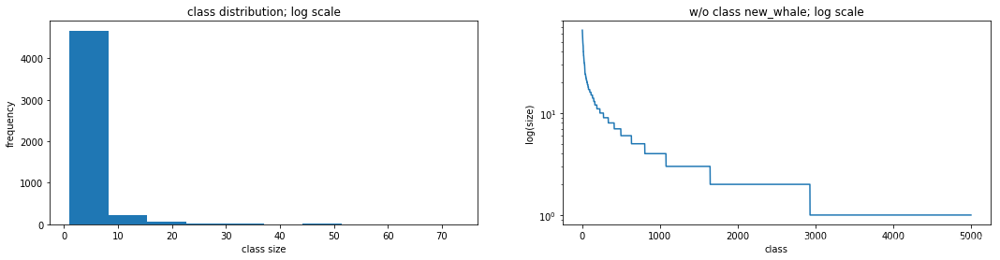
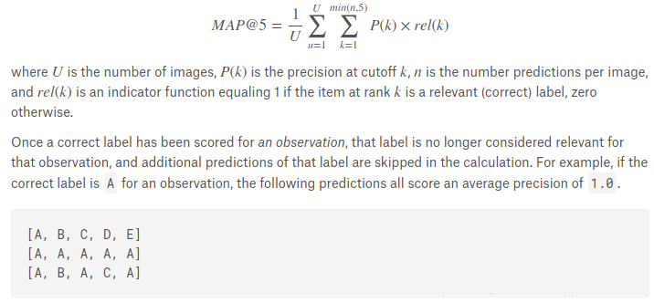
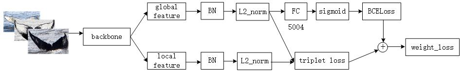

# Kaggle Competition Whale Recognization
竞赛主页: [kaggle: Humpback Whale Identification](https://www.kaggle.com/c/humpback-whale-identification)

## EDA
训练数据有 25,361 张，测试集有 7,960 张，共有 5004 + 1 (new_whale) 类的鲸鱼，未知身份的鲸鱼统一标记为 new_whale。

在训练集中，属于 new_whale 的图像有 9,664 张，只有一张图像的类别有 2,073 类，数据的类别分布极不均衡，仅有单一图像的类别太多，这是一个 one-shot 的识别问题，使用分类来做不会得到较好的结果，需要使用度量学习，不过也有例外，第三名就是使用分类的方法，使用了 ArcFace，加上关键点，得到了 0.97113 的准确率。

鲸鱼尾部图像样例

图像中鲸鱼尾部的形态差异较大，有严重的遮挡，大小也相差巨大。

## Metric
Mean Average Precision @ 5 (MAP@5):

具体的指标介绍，可以看这个[kernel](https://www.kaggle.com/pestipeti/explanation-of-map5-scoring-metric)

## Local Validation
保留仅有一张图像的类别，剩下的抽取 512 个 ID，每个 ID 随机抽取 1 张，new_whale 中抽取 230 张 (根据测试集中的 new_whale 比例)，共 742 张作为本地验证机，与 LB 分数相差不多

## Solution
**关键点：** 
* 充分使用`new_whale`类别的数据

  如果使用分类，仅使用带有确切ID的图像进行训练，设定阈值，置信度小于阈值时归于`new_whale`类，首先2000多个ID仅有一张图像，数据具有严重的数据分布不平衡；其次，分类无法将`new_whale`类加入训练，`new_whale`类的图像有9000多张，占了数据的1/3左右，无法加入训练的话损失很大。
  
只有解决了上述两点问题，再加上ArcFace以及其他细粒度识别的方法，分类才能取得较好的效果。

* 将图像HFlip之后当作新的类别，扩充数据和类别

  因为鲸鱼尾部并不是对称的，水平翻转之后不能当作同一个鲸鱼的尾部图像。
  

分类与metric learning级联的方法：

**分类**：

构建5004个二分类器，每个分类器判别图像是否属于这一类，对于单个分类器而言，对于其他`ID`和`new_whale`的图像都属于其他类，这样训练可以将`new_whale`的数据加入训练，可以带来巨大提升，当一张图像均不属于这5004类时，该图像分为`new_whale`类。

**metric learning**:

由于图像中鲸鱼尾部的形态差异较大，有严重的遮挡，大小也相差巨大，与Re-ID的数据类似，所以考虑使用Re-ID中的方法，这里使用了`triplet loss`

最终将两种方法的损失加权级联，共同监督网络收敛。

## Tricks
* 将图像HFlip之后当作新的类别，扩充数据和类别
* 分阶段训练，先使用数量大于10的ID进行与训练，然后freeze部分网络，使用全部数据fine-tuning
* data distillation
 使用playground和testset的数据进行数据蒸馏
* 输入图像长宽比为 2：1
* TTA (test time augmentation)
* ensemble
* bounding box或者mask

## ENVS
python == 3.6

torch == 0.4.1

## RUN
下载[featured](https://www.kaggle.com/c/humpback-whale-identification/data)和[playground](https://www.kaggle.com/c/whale-categorization-playground/data)的数据，解压到`./data`

Train:

* Step 1

更改`train.py`中

  freeze = False
  model_name = 'senet154'
  min_num_class = 10
  checkPoint_start = 0
  lr = 3e-4
  
  
  当网络收敛后终止训练(大概train map5 >= 0.98)

* Step 2
更改`train.py`中

  freeze = True
  model_name = 'senet154'
  min_num_class = 0
  checkPoint_start = best checkPoint of step 1
  lr = 3e-4
  `
  
  网络收敛后终止训练

* Step 3
更改`train.py`中

  lr = 3e-5

Test:

更改`test.py`

checkPoint_start = best checkPoint of step 3

